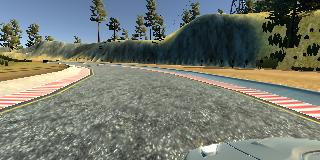
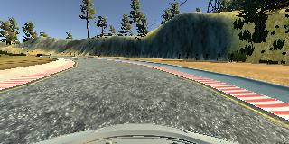
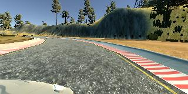

### Behavioral Cloning project

---

In this project a Convolutional Neural Network (CNN) is used to clone and predict
a car's steering angles based on images.

Note: This project uses a Unity-based car simulator developed at Udacity Inc.
and a dataset of images that is generated from it, none of which are included
in this repository.

---

#### Directory layout

* scripts : Source containing the CNN model and training/data-loading routines.
* images : Sample images used in this document.
* drive.py : Udacity provided source to control/feed the steering-angles from a
given trained-model, along with other parameters like throttle.
* model.h5 : Trained CNN model using Keras.
* video_track1.mp4 : Video recording of the car driving in autonomous mode on
Track 1 of the simulator.

#### Project Goals

1. Collecting data from the simulator that simulates good driving behavior.
For this project, the focus was on having the car driving on the center of the lane.

2. Building a convolution neural network in Keras that predicts steering angles
from images.

3. Training and validating the model with a training and validation set.

4. Testing that the model successfully drives for one lap without leaving the road.

#### Data collection

Training data for predicting the steering-angles was collected using the simulator.
Three laps on Track 1 was run in the desired direction. It was noted that the
track had more left-turns compared to right ones. To avoid having the model overfitting
on left-steering-angles, additional data was collected by driving the car in the
opposite direction on the same track for two laps. Images from the center camera
of the car were used to train the model.  Sample images from the left, center and
right cameras are shown below.

| |  |  |
|:---:|:---:|:---:|
|Left camera image|Center camera image|Right camera image|

#### Model architecture and Training

For predicting the steering commands based on the images, the CNN architecture from
nVidia on [End to End Learning for Self Driving Cars](https://arxiv.org/abs/1604.07316)
is used. Keras is used to build and train the model.

