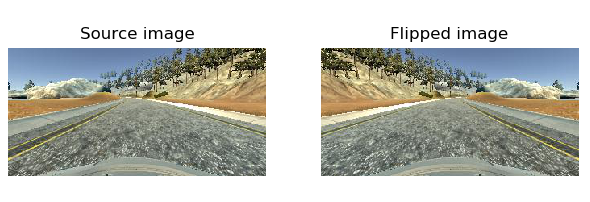
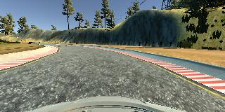

### Project Writeup

#### Project Goals

1. Collecting data from the simulator that simulates good driving behavior.
For this project, the focus was on having the car driving on the center of the lane.

2. Building a convolution neural network in Keras that predicts steering angles
from images.

3. Training and validating the model with a training and validation set.

4. Testing that the model successfully drives for one lap without leaving the road.

#### Data collection

Training data for predicting the steering-angles was collected using the simulator.
Three laps on Track 1 was run in the desired direction. It was noted that the
track had more left-turns compared to right ones. To avoid having the model overfitting
on left-steering-angles, additional data was collected by driving the car in the
opposite direction on the same track for two laps, to have images similar as follows.

Images from the center camera
of the car were used to train the model.  Sample images from the left, center and
right cameras are shown below.

| |  |  |
|:---:|:---:|:---:|
|Left camera image|Center camera image|Right camera image|

#### Data preprocessing

Collected data contains RGB images with dimensions width=160 pixels and
height=320 pixels. Most of the preprocessing steps like cropping the images and
normalizing them were done as part of building the CNN model, as described in
the section below.

#### Model architecture and Training

For predicting the steering commands based on the images, the CNN architecture from
nVidia on [End to End Learning for Self Driving Cars](https://arxiv.org/abs/1604.07316),
as shown below, is used. Keras is used to build and train the model.

##### Architecture layout

Following preprocessing steps on the images, which were added as part of the model,
were carried out.

* Cropping the images : 70 pixels from the top, containing information other than the
lane's features and 25 pixels from the bottom having part of the car's body were
cropped from the image.

* Normalizing the images : Intensities of RGB pixels of the images were mean-centered around zero with small standard deviation.

* Architecture summary : Below given is the model's architecture details. In total,
five convolutional layers with ReLU activations and four fully-connected layers
are used. This architecture is inspired from nVidia's model shown above.

| Layer          | Description                                           |
|:--------------:|:-----------------------------------------------------:|
| Input          | 160x320x3  image                                      |
| 2D cropping    | 2-dimensional cropping of input image. Output = 65x320x3 |
| Lambda         | Normalizes the images by centering their mean to 0. Output = 65x320x3 |
| Convolutional, ReLU activation  | 5x5 filter, 2x2 stride. Output = 31x158x24 |
| Convolutional, ReLU activation  | 5x5 filter, 2x2 stride. Output = 14x77x36  |
| Convolutional, ReLU activation  | 5x5 filter, 2x2 stride. Output = 5x37x48   |
| Convolutional, ReLU activation  | 3x3 filter, 1x1 stride. Output = 4x36x64   |
| Convolutional, ReLU activation  | 3x3 filter, 1x1 stride. Output = 3x35x64   |
| Fully connected | Output = 100 |
| Fully connected | Output = 50  |
| Fully connected | Output = 10  |
| Fully connected | Output = 1   |

* Regularization : L2 regularization and dropout layers didn't seem to improve the model's accuracy, rather decreased it. Hence they aren't included in this architecture.

##### Training routine

* Total number of images used during the training phase is 7040.

* Image dataset is split into train and validation set, where 20% of the images
are set aside for the validation set.

* Mean Squared Error (MSE) over the predicted steering-angle and actual steering-angle
is used as the cost function.

* Adam optimizer is used to optimize the cost function, leaving us to just tune
the number of epochs.

* The model is trained over 3 epochs.

* During the training phase, a prediction accuracy of ~ 99.987 % over the validation
set is obtained.

* Following image shows the MSE accuracy over training and validation sets over 3
epochs. It has been noted that the MSE increased for validation set during 2nd epoch
which happens when the model is overfitting, but the accuracy during 3rd epoch proved
otherwise.

##### Testing routine

* To test the trained model, the simulator was initialized in autonomous mode.
Using the provided `drive.py` script, the car received steering and throttle commands.

* After managing the two steep turns (left and right) following the bridge, the
predicted steering angles couldn't follow the road's center. Additional data was
collected around these areas to make the model train predict the steering-angles
that'd bring the car back to the road's center.

* Sample recording of the autonomous run on Track 1 is available in [this video](video_track1.mp4).
